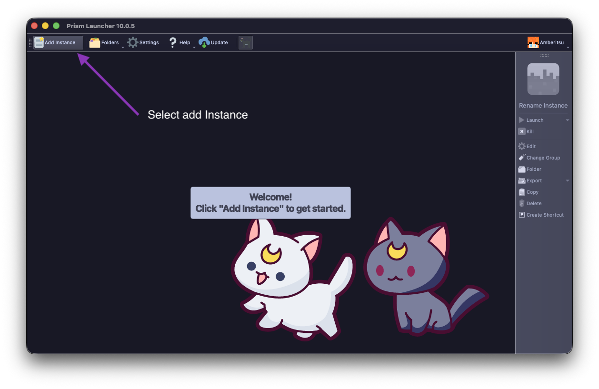
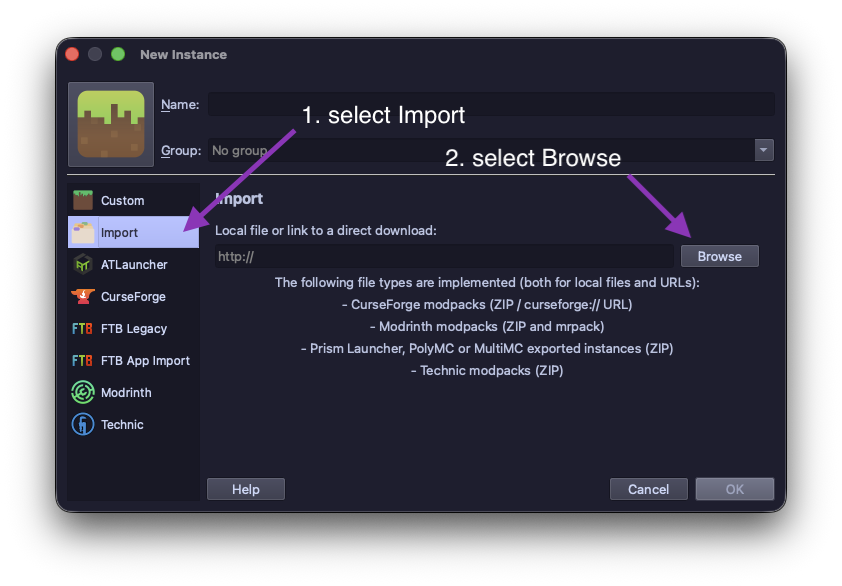
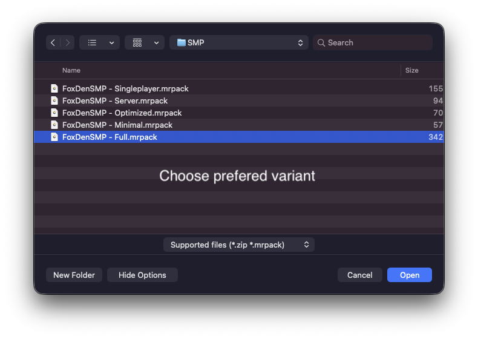
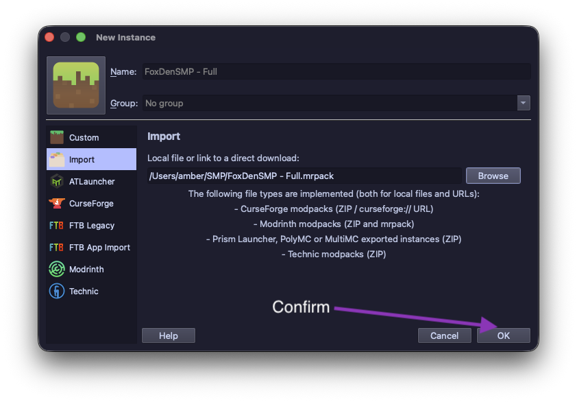
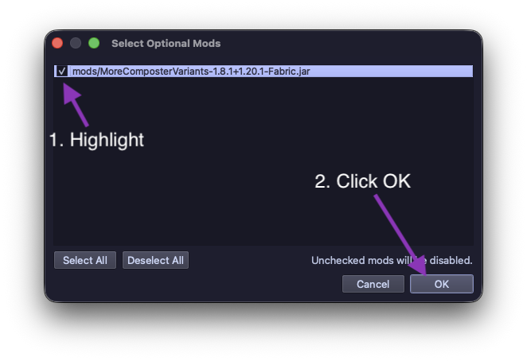

# Install
### Download
Download **Prism Launcher** from their [website](https://prismlauncher.org/) or [GitHub](https://github.com/PrismLauncher/PrismLauncher/releases)

### Add Instance
Select the "Add Instance" option in the top menu

### Import Modpack
From the sidebar in the window that just opened, select *Import*. Then select *Browse*

### Preferred variant
Select the variant of the modpack you prefer to use. 
Generally I recommend the Full modpack for the best experience

### Confirm
Confirm the important of the instance, and unless you're prompted about optional mods, you're done and can launch the modpack!

### Select Option Mods prmpt
This option is *only* relevant if you get prompted. Since MoreComposterVariants is essential to be able to connect to the server. Make sure to highly it if prompted about option mods
